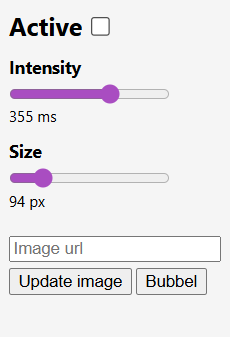

# Bubbel rain

Copyright (C) 2026 Abbe Andersson Vass

Bubbel rain is a Chrome extension that creates a rain of Bubbel images in the browser.

The extension was originally created in February 2025 as a funny thing but with another image.

In this open version the default image is my profile picture _Bubblan_ (The Bubble) - a regular Minecraft bubble - but it can easily be changed to any image on the internet.

## Getting Started
Updated Mars 2026

1. To run this extension, download the whole repository and make sure it's unpacked.

2. Open the extensions menu in Chrome, either by clicking the puzzle piece next to the search bar or by copying `chrome://extensions/` into the search bar.

3. Enable **Developer mode** by clicking the toggle switch in the top right corner of the page and click the **Load unpacked** button that appears.

4. Locate, select and open the folder with the extension. It is most likely named `Bubbel-rain-main` if you did not rename it.

5. The extension is now ready to be used in developer mode in your browser but I highly recommend that you go in to the **Details** of the extension and toggle on **Pin to toolbar**. This makes sure that it always appear and is accessible in the toolbar next to the search bar. It's by clicking the bubble icon in the toolbar that you open the controls for the extension.

## Controls

- The rain can be toggled on and off by clicking the **Active** checkbox at the top of the menu.

- The intensity of the rain can be adjusted with the **Intensity** slider.

- The size of the raindrop images can be adjusted with the **Size** slider.

- The raindrop images can be changed by pasting the URL of another image into the text input that says **Image url** and clicking **Update image**.

- Clicking the **Bubbel** button updates the raindrop images back to the default image.

## License
Bubbel rain is licensed under the terms of the MIT License. See the file `LICENSE` for the full license text.
